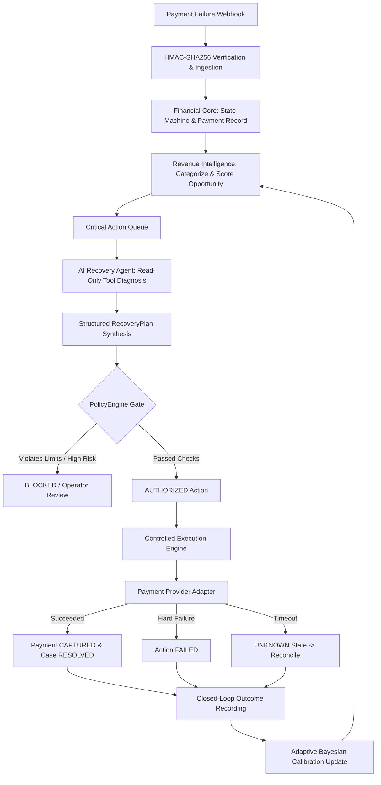

# ⚡ RecoverX — Autonomous AI Revenue Recovery Platform

[](https://www.python.org/)
[](https://fastapi.tiangolo.com)
[](https://react.dev)
[](https://www.typescriptlang.org)
[](https://www.postgresql.org)
[](https://tailwindcss.com)
[]()

> **RecoverX** is an autonomous revenue recovery system for payment platforms. It ingests failed payment webhooks into a verified financial core, extracts explainable recovery opportunities, reasons over failures with an AI recovery agent, enforces policy guardrails, executes retries, and continuously calibrates its strategies through closed-loop feedback.

---

## 🏛️ System Architecture

```
 ┌────────────────────────────────────────────────────────────────────────────────────────┐
 │                              RECOVERX CLOSED-LOOP ARCHITECTURE                         │
 └────────────────────────────────────────────────────────────────────────────────────────┘

    Incoming Payment Webhook (HMAC-SHA256 Signed, Idempotent)
                │
                ▼
 ┌───────────────────────────────┐
 │ 1. FINANCIAL CORE             │ ◄── Normalized State Machine (Payment, Attempt, Case)
 │    & OUTBOX ENGINE            │ ◄── Out-of-Order Resilient, Zero Floating-Point Math
 └──────────────┬────────────────┘
                │
                ▼
 ┌───────────────────────────────┐
 │ 2. FAILURE INTELLIGENCE &     │ ◄── Deterministic Classification (Bank, Network, Auth)
 │    OPPORTUNITY SCORING        │ ◄── Merchant-Relative Normalization & Yield Calculation
 └──────────────┬────────────────┘
                │
                ▼
 ┌───────────────────────────────┐
 │ 3. BOUNDED AI RECOVERY AGENT  │ ◄── Untrusted Reasoning (Gemini / Groq / OpenAI / Mock)
 │    & TOOL REGISTRY            │ ◄── Read-Only Sandboxed Diagnostic Tools (Zero DB Mutation)
 └──────────────┬────────────────┘
                │ Generates RecoveryPlan
                ▼
 ┌───────────────────────────────┐
 │ 4. DETERMINISTIC POLICYENGINE │ ◄── Zero-Bypass Authority (Limits, Eligibility, Whitelists)
 │    & RBAC AUTHORIZATION       │ ◄── Returns: ALLOWED | BLOCKED | REQUIRES_APPROVAL
 └──────────────┬────────────────┘
                │ Authorized Action
                ▼
 ┌───────────────────────────────┐
 │ 5. CONTROLLED EXECUTION       │ ◄── Idempotent Provider Adapters (Smart Retry, Reminders)
 │    & UNKNOWN RECONCILIATION   │ ◄── Fail-Safe Timeout Transition & Polling Reconciliation
 └──────────────┬────────────────┘
                │ Provider Outcome
                ▼
 ┌───────────────────────────────┐
 │ 6. AUDIT & CLOSED-LOOP        │ ◄── Immutable Hash-Linked Audit Event Trail
 │    BAYESIAN CALIBRATION       │ ◄── Online Beta-Binomial Updating (Bounded Priors ±20%)
 └───────────────────────────────┘
```

### End-to-End Workflow Diagram



---

## ⚡ Quick Start & Local Setup

### 1. Prerequisites
- **Python**: 3.12+
- **Node.js**: 20+ & `npm`
- **PostgreSQL**: 16+ (or Docker)
- **Redis**: 7+ (optional for local standalone test mode)

### 2. Backend Setup
```bash
cd backend
python -m venv .venv
# On Windows:
.venv\Scripts\activate
# On Linux/macOS:
source .venv/bin/activate

pip install -r requirements.txt
cp .env.example .env
alembic upgrade head
```

### 3. Initialize & Seed Demo Scenarios
```bash
python scripts/reset_demo.py
```
> **What this does**: Clears previous test runs, creates primary & secondary merchants, creates 3 demo users (Admin, Operator, Analyst), seeds 12 customers, generates **Scenarios A, B, C, D**, and populates 65 historical learning records for Bayesian calibration.

### 4. Run the Full Test Suite (187+ Tests)
```bash
pytest -vv
```

### 5. Frontend Setup & Launch
```bash
cd ../frontend
npm install
npm run dev
```
Open **`http://localhost:5173`** in your browser.

---

## 🔑 Demo Access & Role-Based Access Control (RBAC)

RecoverX includes a multi-tenant identity and RBAC setup with 3 test accounts:

| Role | Email | Password | Capabilities |
|---|---|---|---|
| **Admin** | `admin@recoverx.io` | `Admin@RecoverX2026!` | Full platform administration, agent triggering, policy overrides, action execution, model recomputation, multi-tenant switching. |
| **Operator** | `operator@recoverx.io` | `Operator@RecoverX2026!` | Operational monitoring, agent execution, manual action authorization, payment retry dispatch, reconciliation. |
| **Analyst** | `analyst@recoverx.io` | `Analyst@RecoverX2026!` | Read-only analytics, financial funnel inspection, Bayesian calibration monitoring, audit trail inspection. Execution buttons are disabled. |

> ℹ️ *The login screen includes quick auto-fill buttons to switch between roles with a single click.*

---

## 🎬 Walkthrough

Follow this scripted walkthrough to test RecoverX end-to-end:

### 1. Overview Dashboard & Financial Funnel (`/`)
- **Action**: Log in as `admin@recoverx.io`.
- **Look For**: Real-time **Revenue at Risk**, **Est. Recoverable Volume**, **Failure Distribution Charts**, and the **5-Stage Conversion Funnel**.
- **Note**: All financial metrics use integer paises to eliminate floating-point drift. Risk scoring is merchant-relative and deterministic.

### 2. Scenario A — Successful Automated Recovery (`/opportunities`)
- **Target**: Click on `pay_demo_scenario_a_001` (₹2,450, Bank Error, Score: 85).
- **Action**: Click **Launch AI Recovery Agent**. Review the synthesized `RecoveryPlan`.
- **Policy Check**: Observe the green **PolicyEngine Gate** (`ALLOWED`: retry count = 0, action whitelisted).
- **Execution**: Click **Authorize & Execute Action**.
- **Result**: Provider simulates capture, state transitions to `SUCCEEDED`, Payment becomes `CAPTURED`, and a `LearningOutcomeRecord` is automatically fed to the Bayesian calibration model.

### 3. Scenario B — Deterministic Safety Gate in Action (`/opportunities`)
- **Target**: Click on `pay_demo_scenario_b_002` (₹8,900, Insufficient Funds, 3 previous retries).
- **Action**: Launch AI Agent. The agent may propose `RETRY_PAYMENT`.
- **Policy Check**: Observe the red **PolicyEngine Block** (`BLOCKED`: Exceeds maximum 3 retry attempts).
- **Note**: The AI is an untrusted reasoning engine. It cannot execute unauthorized actions or bypass deterministic business rules.

### 4. Scenario C — Provider Timeout & UNKNOWN State Reconciliation (`/actions`)
- **Target**: Inspect action for `pay_demo_scenario_c_003` (₹4,200).
- **Status**: Action is parked in `UNKNOWN` state to prevent duplicate card charges.
- **Action**: Click **Reconcile with Provider**.
- **Result**: System queries mock provider status endpoint, resolves transaction status to `SUCCEEDED`, and updates financial ledger.

### 5. Scenario D — Multi-Tenant Isolation Protection
- **Target**: Attempt to query `pay_acme_isolated_999` while authenticated as Demo Merchant.
- **Result**: Query rejected with HTTP `404 Not Found in tenant financial records` (IDOR protection).

### 6. Adaptive Bayesian Intelligence & Calibration (`/learning`)
- **Action**: Navigate to **Adaptive Learning**.
- **Look For**: Prior vs Posterior recovery probabilities, Beta-Binomial distributions, and the bounded calibration window (±20% guardrail).
- **Action**: Click **Recompute Learning Model** to trigger a statistical recalibration across the 65+ seeded historical outcomes.

---

## 🛡️ Key Architectural & Engineering Decisions

### Q1: Why is the LLM separated from financial calculations and direct execution?
**Answer**: Large Language Models are non-deterministic. In RecoverX:
1. **Financial math & scoring** are deterministic Python/SQL code (`RevenueIntelligenceEngine`).
2. The AI Agent is isolated to **read-only diagnostic tools** (`ToolRegistry`).
3. The AI Agent only produces a declarative **`RecoveryPlan` data structure**.
4. The **`PolicyEngine`** is the sole execution authority. If an AI proposes an invalid action, the PolicyEngine rejects it with zero database mutation.

### Q2: How does RecoverX prevent double-charging and duplicate execution?
**Answer**:
1. **Idempotency Keys**: Every `RecoveryAction` generates a deterministic idempotency key (`hash(payment_id, action_type, attempt_number)`).
2. **State Machine Locks**: `ActionStateMachine` enforces atomic state transitions (`PROPOSED` → `POLICY_CHECK` → `AUTHORIZED` → `EXECUTING` → `SUCCEEDED`/`FAILED`/`UNKNOWN`).
3. **Database Constraints**: Unique constraints on `(merchant_id, idempotency_key)` prevent duplicate insertions.
4. **UNKNOWN Transition**: If a gateway call times out or returns network errors, the action transitions to `UNKNOWN` rather than blindly retrying, preventing duplicate charges.

### Q3: How does Closed-Loop Learning work without model drift?
**Answer**:
1. Every executed recovery action writes a `LearningOutcomeRecord` recording failure category, strategy, payment amount, and outcome.
2. The **Adaptive Strategy Engine** uses conjugate **Beta-Binomial Bayesian Updating** where:
   $$\alpha_{post} = \alpha_{prior} + \text{successes}, \quad \beta_{post} = \beta_{prior} + \text{failures}$$
3. **Bounded Priors Guardrail**: Posterior estimates are clamped within $\pm 20\%$ of baseline domain priors to eliminate drift from unrepresentative small sample bursts.

### Q4: How is Multi-Tenant Security enforced across the platform?
**Answer**:
1. Every incoming JWT token validates against `TenantContext` containing `user_id`, `merchant_id`, and `role`.
2. All database queries, outbox events, and execution calls filter by `merchant_id`.
3. Cross-tenant queries return `404 Not Found` (rather than `403 Forbidden`) to prevent merchant resource enumeration.

---

## 🧪 Evaluation Benchmark & Resilience Test Suites

RecoverX includes an automated test matrix:

| Test Suite | Purpose | Tests |
|---|---|---|
| `test_phase7_ai_evaluation_suite.py` | 50 synthetic test cases testing valid plan structure, tool read-only immutability, and PolicyEngine safety block rates. | 4/4 Passed |
| `test_phase7_resilience_concurrency.py` | Idempotency deduplication, timeout UNKNOWN transition, adversarial AI rejection, and cross-tenant isolation. | 4/4 Passed |
| `test_phase6_auth_rbac_tenancy.py` | JWT authentication, role-based capability enforcement, and tenant scoping. | 9/9 Passed |
| `test_phase5_critical_validation.py` | Full closed-loop payment lifecycle, outbox dispatching, and state machine consistency. | 7/7 Passed |
| `test_phase5_learning.py` | Bayesian Beta-Binomial updating, Brier score calculation, and ±20% bounding. | 7/7 Passed |
| `test_phase4_execution.py` | Provider adapters, retry execution, and reconciliation workflows. | 13/13 Passed |
| `test_intelligence_components.py` | Feature extraction, failure categorization, and opportunity scoring. | 26/26 Passed |
| `test_agent_components.py` | Prompt sandboxing, tool registry, and structured schema parsing. | 27/27 Passed |
| **Total Test Suite** | **Full platform integration across all modules** | **187 Passed** |

---

## 📦 Project Structure

```
RecoverX/
├── backend/
│   ├── alembic/                 # Database migrations (Versions 001 - 007)
│   ├── app/
│   │   ├── agent/               # AI Recovery Agent, Prompt Sandboxing & PolicyEngine
│   │   ├── auth/                # JWT Authentication, RBAC & Tenant Context
│   │   ├── core/                # Configuration, Database Sessions & Security
│   │   ├── db/                  # SQLAlchemy ORM Base & Models
│   │   ├── execution/           # Controlled Execution, Adapters & Reconciliation
│   │   ├── intelligence/        # Deterministic Revenue Intelligence & Scoring
│   │   ├── learning/            # Empirical Bayesian Calibration & Strategy Ranking
│   │   ├── modules/             # Payments, Customers, Webhooks & Outbox
│   │   └── main.py              # FastAPI Application Factory & Routers
│   ├── scripts/
│   │   └── reset_demo.py        # Master Deterministic Sandbox Seeder
│   └── tests/                   # Complete Pytest Suite (187+ tests)
└── frontend/
    ├── src/
    │   ├── api/                 # Strongly-typed Axios / TanStack Query API Client
    │   ├── components/          # Reusable UI Components, Charts, Funnels & Badges
    │   ├── features/            # Feature Views (Overview, Opportunities, Agent, Actions, Learning, Audit)
    │   ├── types/               # TypeScript Domain Interfaces & Enums
    │   ├── App.tsx              # React Router & Role-Aware Layout
    │   └── main.tsx             # React Root Mount
    ├── tailwind.config.js       # Modern Dark-Mode Theme & Design Tokens
    └── vite.config.ts           # Vite Build Pipeline
```

---

## ⚖️ License
Sandbox demo application for automated revenue recovery.
